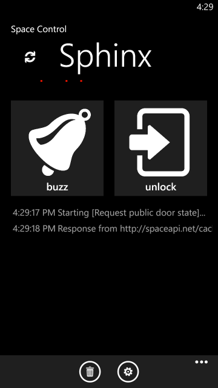
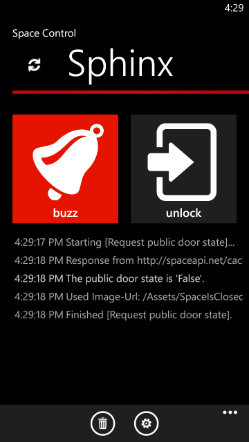
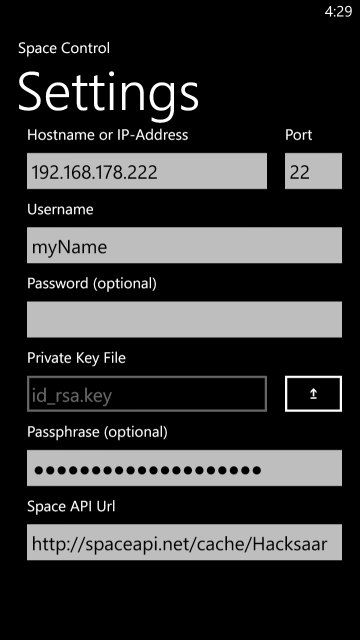

# Space Control 

A Windows Phone 8 remote control for the [Hacksaar Sphinx](http://wiki.hacksaar.de/Sphinx).

## Usage

Immediately after launch the Space Control App will request the public door state via  the [SpaceApi](http://spaceapi.net/). An open door will be indicated by a green bar; a closed door appears as a red bar.

If the door is closed, which means you are the first member joining the space, tap `buzz` to open the front door downstairs. Tap `unlock` to open the appartment door upstairs.  [Sphinx](http://wiki.hacksaar.de/Sphinx) will unlock the door, welcome you and let you in.   

> Please ensure that your phone is connected to the wireless network before tapping `buzz` or `unlock`. It is not possible (at least with this app) to open the door if you are not connected to the wireless network.
  

## Configuration

Sphinx will only trust you and open the doors if you have added your credentials to the Space Control app. To do so, navigate to the settings screen and enter at least your username and a private key file. 

> Remember to hand out the associated **public** key file to one of the [Sphinx door admins](http://wiki.hacksaar.de/Sphinx). If you forgot this step, Sphinx will never trust you, keep the door closed and leave you outside in the cold!

## Dependencies

* [Json.NET](http://json.codeplex.com/) - The MIT License (MIT)
* [SSH.NET](https://sshnet.codeplex.com/) - New BSD License (BSD)
* [WPtoolkit](http://phone.codeplex.com/) - Microsoft Public License (Ms-PL)

## License

[The MIT License](LICENSE.md) (MIT)